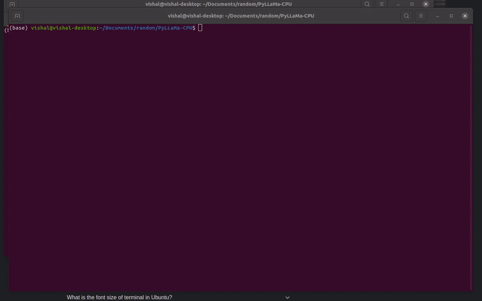

# PyLLaMa-CPU

Inference of [LLaMA](https://arxiv.org/abs/2302.13971) model on CPU using bindings and wrappers to [llama.cpp](https://github.com/ggerganov/llama.cpp)


Run LLaMa models by Facebook on CPU with fast inference.  
The 7B model with 4 bit quantization outputs 8-10 tokens/second on a Ryzen 7 3700X.

  

---

## Usage

An exmaple file is provided for text completiuon using user input.   
Update the `MODEL_PATH` parameter in the file to point to the ggml models.  
Run the file as `python3 example.py`  

---

## Installtion

### Requirements

1. CMAKE
2. Python 3.8+
3. C++17 or newer

To install CMake:  

```bash
sudo apt-get -y install cmake # For Linux
brew install cmake # For OS X

# For Windows install CMake from [Download page](https://cmake.org/download/) and install using the windows installer.
```

### Building

For installation, build the project from source using the following commands:  

```bash
git clone https://github.com/VPanjeta/PyLLaMa-CPU
cd PyLLaMa-CPU

chmod +x build.sh

./build.sh

# If you have access to LLaMa model weights, place them in "models" folder as such

ls ./models
65B 30B 13B 7B tokenizer_checklist.chk tokenizer.model

# install Python dependencies
pip install -r requirements.txt

# Convert the model from .pth to ggml fp16 format with .bin extension
python3 convert-pth-to-ggml.py models/7B/ 1

# Quantize the model using
python3 quantize.py 7B

# Update the MODEL_PATH in exmaple file and run inference
python example.py
```

If you already have 4 bit quantized weight, you can directly build and run the inference.  

### Importing in your own project


```python
import sys

sys.path.append("./build/")

import pyllama_cpu as llama
```

### Initializing the Model
```python
MODEL_PATH = "./models/7B/ggml-model-q4_0.bin"

model = llama.Model(
    path=MODEL_PATH, # Path to model file
    num_threads=8, # Number of threads to use
    n_ctx=512, # Content size in tokens
    last_n_size=64, # How many tokens to be used for repeat penalty (Optional)
    seed=0 # Seed for random number generator (Optional)
)
```

### Running Inference


#### Ingesting Prompts
```python
prompt = """Once upon a time, in a far-off land, there was a young princess named """

res = model.ingest(prompt) 
```
### Generating Output
```python
def flush_output(token: str) -> None:
    """
    This function is used to flush streaming data to STDOUT
    """
    print(token, end='', flush=True)

res = model.generate(
    num_tokens=100, # Number of tokens to be generated
    top_p=0.95, # Sampling top p (Optional)
    temp=0.8, # Temperature (Optional)
    repeat_penalty=1.0, # Penalty for repetition (Optional)
    streaming_fn=flush_output, # Streaming output function
    stop_word="close" # Stop generation in between when this word is generated (Optional)
)
```

---

## System Requirements
The 4 bit ggml models require the following amount of system memory:  


| model | original size | quantized size (4-bit) |
|-------|---------------|------------------------|
| 7B    | 13 GB         | 3.9 GB                 |
| 13B   | 24 GB         | 7.8 GB                 |
| 30B   | 60 GB         | 19.5 GB                |
| 65B   | 120 GB        | 38.5 GB                |


### Supported Instruction Sets
 - SVX2 for x86 architectures
 - Apple Silicon via Arm NEON.


This project is a python binding on top of [llama.cpp](https://github.com/ggerganov/llama.cpp). Do have a look at their project.